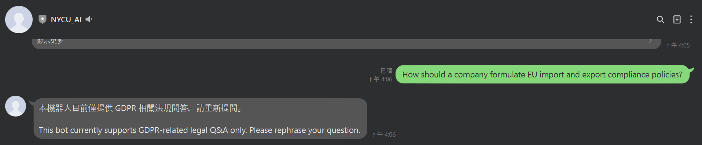

# GDPR LINE Bot: Controlled AI Legal Q&A System

A controlled AI-powered GDPR question-answering system that avoids hallucination by combining semantic retrieval with offline-validated answers.

---

## 🔍 What Makes This Project Different

Most AI chatbots rely on real-time LLM generation, which can produce:

- hallucinated legal interpretations  
- inconsistent answers  
- low traceability  

👉 This project takes a different approach:

- No real-time LLM generation in production  
- All answers are pre-validated and fixed  
- Semantic retrieval is used instead of generation  

This makes the system **more reliable, controllable, and auditable** for legal use cases.

---

## 🧠 Key Idea

> Use LLM as a **validator**, not as the **final answer generator**

- LLM is used **offline** to validate QA pairs  
- The online system only retrieves **approved answers**  
- Every response is **traceable to GDPR articles**

---

## 🖼️ Demo

### 1. Precise Legal Query

### 2. Semantic / Ambiguous Query

### 3. Bilingual Query (EN / ZH)

### 4. Out-of-Scope Question Handling

### 5. Knowledge Boundary Control (Critical)

---

## 🏗️ System Architecture
# GDPR LINE Bot: Controlled AI-Assisted Privacy Q&A Prototype

A controlled AI-assisted GDPR Q&A prototype using semantic retrieval and offline-validated responses.

## Project Overview

This project is a legal-tech and privacy-tech prototype designed to answer GDPR-related questions through a controlled semantic retrieval workflow.

Instead of relying on real-time large language model generation, the system uses a **two-phase architecture**:

1. **Offline construction phase** for preprocessing, semantic chunking, embedding generation, and Q&A validation  
2. **Online query service phase** for LINE Bot question answering through similarity-based retrieval of pre-validated responses

The core design goal is to improve **controllability, consistency, and traceability** in legal question answering while reducing the risk of **legal hallucination**.

---

## Why This Project

Legal and compliance teams increasingly explore AI tools for regulatory knowledge access. However, in legal contexts, fully generative systems can introduce risks such as:

- inaccurate legal interpretation
- unstable responses
- hallucinated or unverifiable outputs
- low traceability of answer sources

This prototype was built to explore an alternative approach:

> use AI for **semantic retrieval and offline validation**, while keeping the final online response source fixed and controlled.

This design is particularly relevant for **privacy compliance** and **legal knowledge management** scenarios.

---

## Core Design Concept

The system is not a conventional real-time generative chatbot.

It is a **controlled legal Q&A system** that combines:

- semantic retrieval
- offline Q&A validation
- pre-finalized answer database
- LINE Bot delivery interface

In this architecture:

- LLM is used only in the **offline QA pipeline** as a validation assistant
- online responses are retrieved from a **finalized QA JSON knowledge base**
- the final answer source remains **stable, reviewable, and traceable**

---

## System Architecture

### 1. Offline Construction Phase

The offline phase is responsible for preparing and validating the knowledge base.

Main steps:

- collect and structure GDPR Articles 1–11
- preprocess and normalize legal text
- split the regulation into semantically meaningful chunks
- generate embeddings for legal chunks
- run bilingual and multi-question QA testing
- use ChatGPT API as an offline validation assistant
- revise and finalize answers manually
- build the final QA JSON database and its embeddings

### 2. Online Query Service Phase

In the online phase:

1. the user submits a question through LINE Bot
2. the question is converted into an embedding
3. cosine similarity is used to compare it against the finalized QA embeddings
4. the most relevant validated answer is retrieved
5. the system returns the answer to the user

Importantly, the online system **does not call ChatGPT API in real time**.

This helps ensure:

- more stable outputs
- reduced hallucination risk
- answer consistency
- higher reliability for legal use cases

---

## Current Technical Stack

### Embedding Models
- **sentence-transformers/multilingual-e5-base**  
  Used in the offline QA pipeline construction stage

- **text-embedding-3-small**  
  Used in the online retrieval stage for LINE Bot query matching

### Similarity Method
- cosine similarity

### LLM Usage
- **ChatGPT API (gpt-3.5-turbo)**  
  Used only in the offline QA validation process, not as the final online response generator

### Interface
- LINE Bot
- Python-based backend developed in Google Colab / notebook workflow

---

## Data Scope

The current prototype covers:

- **GDPR Articles 1–11**
- bilingual legal text handling
- semantic chunking based on legal structure
- finalized QA database for controlled retrieval

The project currently includes:

- 30 test questions in total
- legal questions
- semantic variation questions
- bilingual equivalence questions
- out-of-scope questions

---

## Chunking Strategy

The chunking method evolved through three stages:

### Stage 1: Fixed-length chunking
Initial chunking used approximately 500-character segments.  
This was simple to implement but often damaged legal meaning.

### Stage 2: Auto-merge repair strategy
Short or semantically broken chunks were automatically merged with the next chunk, within the same legal structure when possible.

### Stage 3: Structure-oriented chunking
The final adopted strategy uses GDPR legal structure:

- Article
- Paragraph
- Subparagraph

This approach improved:

- semantic completeness
- legal interpretability
- embedding quality
- QA pipeline reliability

---

## Data Preprocessing

The preprocessing workflow includes:

- missing value handling
- text cleaning and normalization
- structural standardization
- outlier filtering
- chunking
- exploratory checks
- QA pair construction

---

## Key Project Value

This project demonstrates a practical AI design choice for legal and privacy use cases:

- **LLM as validator, not final answer source**
- **retrieval-based legal response control**
- **traceable and reviewable answer logic**
- **privacy/legal domain adaptation**
- **bilingual experimentation in English and Chinese**

It is best understood as a **privacy/legal-tech prototype**, not a production-ready compliance product.

---

## Current Limitations

This is an early-stage prototype and has several limitations:

- currently limited to **GDPR Articles 1–11**
- only a small number of core legal questions are included
- current questions are mostly basic principle-level questions rather than practical business scenarios
- no knowledge graph (KG) integration yet
- the offline QA pipeline currently uses **gpt-3.5-turbo**, not a stronger model such as GPT-4o-mini
- legal coverage is not yet extended to all **99 GDPR Articles** and **173 recitals**

---

## Future Improvements

Planned future directions include:

- expand coverage to all GDPR Articles and selected recitals
- add more scenario-based business and technology-related legal questions
- integrate knowledge graph (KG) for improved legal relationship mapping
- upgrade the offline QA pipeline with a stronger LLM
- improve evaluation methodology
- enhance deployment structure beyond notebook-based experimentation

---

## Intended Use

This project is intended for:

- AI + privacy learning
- legal-tech experimentation
- regulatory knowledge retrieval research
- portfolio demonstration of privacy/governance-oriented AI application design

It is **not legal advice** and is **not a production-ready compliance system**.

---

## Author Note

This project was developed as part of an interdisciplinary AI and ChatGPT applications program, with a focus on exploring how AI can be applied to privacy law and legal knowledge workflows in a more controlled and reliable way.
