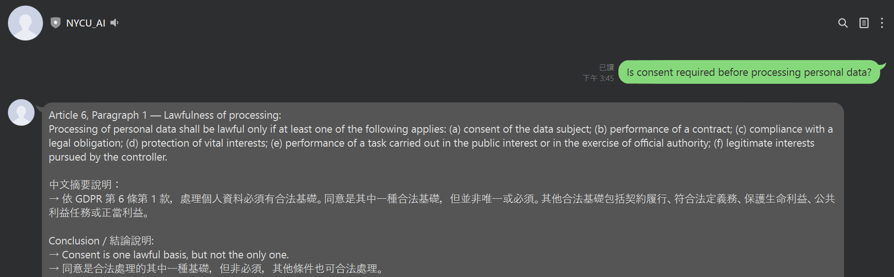
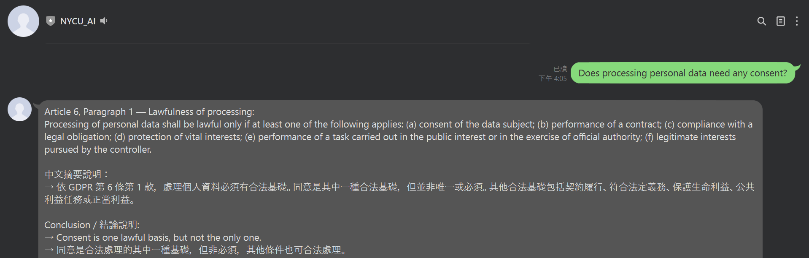
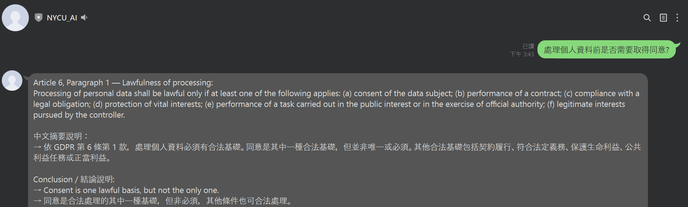
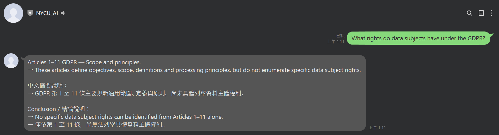

# GDPR LINE Bot: Controlled AI Legal Q&A System

A **controlled legal AI system** that answers GDPR questions without real-time LLM generation.

Instead of generating responses on the fly, this system:
- retrieves answers from a **pre-validated QA knowledge base**
- ensures **legal traceability**
- avoids hallucination by design

> 💡 LLM is used offline for validation — not as the final answer generator.

---

## 🔍 What Makes This Different

Most AI chatbots rely on real-time generation, which can produce:
- hallucinated legal interpretations  
- inconsistent answers  
- low traceability  

This project takes a different approach:

- ❌ No real-time LLM generation  
- ✅ Pre-validated and fixed answers  
- ✅ Semantic retrieval with full traceability  

👉 Designed for **reliability, control, and legal safety**

---

## 📸 Demo

### 1. Precise Legal Query

---

### 2. Semantic / Ambiguous Query

---

### 3. Bilingual Query (EN / ZH)

---

### 4. Out-of-Scope Query (Fallback)

---

### 5. Knowledge Boundary Control (Critical)

> The system distinguishes between:
> - irrelevant queries → fallback  
> - out-of-scope legal queries → boundary-aware response  

---

## 🧠 Key Insight

This project explores a controlled alternative to generative AI in legal systems.

Instead of optimizing for answer fluency, it prioritizes:

- correctness over creativity  
- traceability over flexibility  
- safety over coverage  

The system demonstrates that:

> A legal AI system should not only answer correctly — it should also know when not to answer.

By combining:

- semantic retrieval  
- offline QA validation  
- strict knowledge boundary control  

this approach reduces hallucination risk and improves reliability in regulated environments.

---

## 🏗️ System Architecture

### High-Level Design

The system adopts a **two-phase architecture**:

- **Offline phase**: builds and validates a controlled QA knowledge base  
- **Online phase**: retrieves only pre-approved answers  

Unlike typical LLM systems:

- No real-time generation in production  
- Responses are fixed, validated, and traceable  

---

### Implementation Pipeline

#### 1. Offline Construction Phase

The offline phase is responsible for preparing and validating the knowledge base.

Main steps:

- collect and structure GDPR Articles 1–11  
- preprocess and normalize legal text  
- split the regulation into semantically meaningful chunks  
- generate embeddings for legal chunks  
- run bilingual and multi-question QA testing  
- use ChatGPT API as an offline validation assistant  
- revise and finalize answers manually  
- build the final QA JSON database and its embeddings  

---

#### 2. Online Query Service Phase

In the online phase:

- the user submits a question through LINE Bot  
- the question is converted into an embedding  
- cosine similarity is used to compare it against the finalized QA embeddings  
- the most relevant validated answer is retrieved  
- the system returns the answer to the user  

Importantly, the online system does **not call ChatGPT API in real time**.

This helps ensure:

- more stable outputs  
- reduced hallucination risk  
- answer consistency  
- higher reliability for legal use cases  

---

## 📁 Project Structure
.
├── notebooks/
│   ├── GDPR_Preprocessing_and_Embedding_clean.ipynb
│   └── LINE_GDPR_QA_Bot_clean.ipynb
│
├── data/
│   └── qa_v1_final.json
│
├── assets/
│   ├── precise_query.png
│   ├── ambiguous_query.png
│   ├── bilingual_query.png
│   ├── fallback.png
│   └── out_of_scope.png
│
├── docs/
│   ├── system_overview.md
│   └── chunking_strategy.md
│
├── evaluation/
│   ├── retrieval_evaluation.md
│   └── limitations.md
│
└── README.md

---

## ⚡ Quick Start

This project is a prototype built in a notebook-based environment.

To explore the system:

1. Open the preprocessing notebook:
   - `notebooks/GDPR_Preprocessing_and_Embedding_clean.ipynb`
   - demonstrates chunking, embedding construction, and QA pipeline

2. Open the LINE Bot notebook:
   - `notebooks/LINE_GDPR_QA_Bot_clean.ipynb`
   - demonstrates query embedding and retrieval workflow

3. Review the final QA dataset:
   - `data/qa_v1_final.json`

> Note: API keys and sensitive credentials are not included.

---

## 📌 Project Overview

This project is a legal-tech and privacy-tech prototype designed to answer GDPR-related questions through a controlled semantic retrieval workflow.

Instead of relying on real-time large language model generation, the system uses a **two-phase architecture**:

1. Offline construction phase for preprocessing, semantic chunking, embedding generation, and Q&A validation  
2. Online query service phase for LINE Bot question answering through similarity-based retrieval of pre-validated responses  

The core design goal is to improve:

- controllability  
- consistency  
- traceability  

while reducing the risk of **legal hallucination**.

---

## 💡 Why This Project

Legal and compliance teams are increasingly exploring AI tools for regulatory knowledge access. However, in legal contexts, fully generative systems can introduce risks such as:

- inaccurate legal interpretation  
- unstable responses  
- hallucinated or unverifiable outputs  
- low traceability of answer sources  

This prototype explores a safer alternative:

> using AI for semantic retrieval and offline validation, while keeping the final online response source fixed and controlled.

This design is particularly relevant for:

- privacy compliance  
- legal knowledge management  
- regulated AI systems  

---

## ⚠️ Disclaimer

This project is for research and demonstration purposes only.  
It does not constitute legal advice.

---

## 📄 License

All rights reserved.

This repository is publicly visible for portfolio purposes only.  
No part of this project may be used, copied, modified, or distributed without explicit permission.

---

## 👤 Author

This project was developed as part of an AI + legal-tech exploration focused on building **reliable and controllable AI systems for regulatory domains**.

Feel free to connect or reach out:

- LinkedIn: https://www.linkedin.com/in/lucy-jenyi-chang-40b643198/
- GitHub: https://github.com/lucyjenyichang
