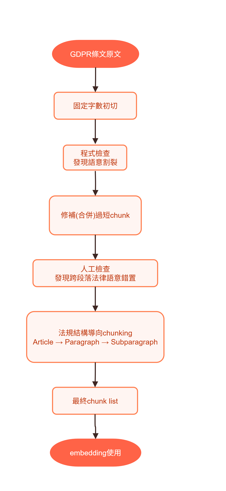

# Chunking Strategy

## Why Chunking Matters

Chunking is a critical design choice in this project because the legal text chunks are the direct input units for embedding generation and semantic retrieval.

In a GDPR question-answering system, poorly designed chunks can degrade retrieval quality in at least three ways:

- they may split legally meaningful provisions into incomplete fragments
- they may merge unrelated provisions across structural boundaries
- they may weaken bilingual alignment between English and Chinese legal text

Because this project aims to build a **controlled and traceable legal QA system**, chunking was treated as a core knowledge-engineering problem rather than a simple preprocessing step.

---

## Design Goal

The chunking strategy was designed to satisfy four requirements:

- preserve legal semantic integrity
- follow the original structure of GDPR provisions
- support bilingual retrieval quality
- provide stable input for offline QA validation and online similarity search

The final goal was not merely to produce chunks of manageable size, but to construct retrieval units that remain legally interpretable and semantically coherent.

---

## Evolution of the Chunking Strategy

The final chunking approach was reached through three iterations.

### 1. Initial Strategy: Fixed-Length Chunking

The earliest version used a simple fixed-length segmentation strategy.

**Design choice**
- each chunk contained approximately 500 characters
- implementation was simple and easy to connect to embedding generation

**Advantage**
- fast to implement
- straightforward for early embedding experiments

**Problem discovered**
- legal meaning was frequently split across chunk boundaries
- paragraph and subparagraph logic could be broken
- bilingual EN/ZH text alignment became unstable in some chunks

This made the approach unsuitable for legal retrieval, where a small structural break can change the meaning of a provision.

---

### 2. Revised Strategy: Automatic Merging of Short Chunks

To reduce fragmentation, a second strategy was introduced.

**Main idea**
- detect problematic chunks
- automatically merge overly short or semantically incomplete chunks with the next chunk
- restrict merging within the same legal structure when possible

**Why this helped**
- reduced extremely short chunks
- improved chunk completeness
- partially repaired fragmented bilingual content

**Remaining limitation**
- some merged chunks still crossed paragraph-level legal boundaries
- this could create slight legal-context misalignment
- manual inspection was still needed

This revision improved the first version, but it still behaved like a repair mechanism rather than a legally grounded chunking strategy.

---

### 3. Final Strategy: Structure-Aware Legal Chunking

The final solution adopted a structure-aware strategy based on the legal hierarchy of the GDPR text.

**Final chunking unit**
- `Article → Paragraph → Subparagraph`

Instead of splitting by character count, each chunk is constructed according to the regulation’s native structure.

**Why this was chosen**
- preserves legal meaning as defined by the source text
- respects the internal hierarchy of the regulation
- improves semantic quality of embedding input
- produces more interpretable retrieval results
- reduces the risk of cross-boundary legal distortion

This final version is the strategy used for the finalized chunk dataset and downstream QA retrieval workflow.

---

## Final Chunk Construction Logic

The finalized chunking workflow follows these principles:

### 1. Structure preservation
Each chunk is aligned with the original GDPR structure rather than an arbitrary text window.

### 2. Bilingual pairing
English and Chinese text are kept together within the same chunk representation to support bilingual retrieval and consistency checks.

### 3. Stable chunk identity
Each chunk is assigned a structure-based identifier derived from its legal position, which improves traceability during retrieval and validation.

### 4. Retrieval-oriented coherence
Chunks are designed to be semantically complete enough for embedding-based matching, while still being narrow enough to avoid mixing unrelated provisions.

---

## Why Structure-Aware Chunking Was Necessary

This project is not a general document search prototype. It is a **controlled legal QA system**.

That distinction matters because legal texts are highly structured. A paragraph, exception, condition, or enumerated item may change the meaning of the whole provision. If chunk boundaries ignore that structure, semantic retrieval may return text that is technically similar but legally incomplete.

For this reason, the final chunking strategy prioritizes:

- legal coherence over implementation simplicity
- structure fidelity over arbitrary length uniformity
- retrieval reliability over raw chunk count efficiency

---

## Data Quality Checks

After the final structure-aware chunking process, additional data quality checks were performed to ensure the chunk set was reliable for downstream retrieval and QA validation.

### Quality checks included:

#### A. Chunk length inspection
To verify that no chunks were excessively short or excessively long.

#### B. Structural uniqueness check
To confirm that chunk identifiers and structural fields (`Article`, `Paragraph`, `Subparagraph`) were not duplicated unexpectedly.

#### C. Bilingual completeness check
To confirm that English and Chinese legal content were both present and properly paired.

#### D. Citation field cleanliness
To ensure that citation metadata remained standardized and free of formatting noise.

These checks helped confirm that the final chunk dataset was suitable for both:

- offline QA pipeline validation
- online semantic retrieval in the LINE Bot system

---

## Final Outcome

The evolution of the chunking strategy can be summarized as follows:

1. **Initial strategy:** fixed-length chunking  
   - simple implementation  
   - caused semantic fragmentation

2. **Revised strategy:** automatic merging of short chunks  
   - reduced chunk fragmentation  
   - still risked structural misalignment

3. **Final strategy:** structure-aware legal chunking  
   - preserved semantic integrity  
   - aligned with legal hierarchy  
   - improved retrieval stability and QA reliability

The final chunking design became an important foundation for the system’s controlled-answer architecture.

Rather than relying on real-time generation, this project depends on the quality of its legal retrieval units. Therefore, chunking is not only a preprocessing detail, but a core component of system reliability.

---

## Diagram

The following diagram summarizes the evolution from fixed-length chunking to the final structure-aware legal chunking strategy.

---

## Relation to the Overall System

This chunking strategy directly supports the broader system architecture:

- in the **offline construction phase**, it improves embedding quality and QA validation reliability
- in the **online query service phase**, it improves similarity matching against the finalized QA knowledge base
- in both phases, it strengthens answer traceability and reduces the risk of misleading legal retrieval

In other words, the system’s controlled behavior depends not only on the final QA database, but also on how the legal text was segmented before retrieval ever began.
