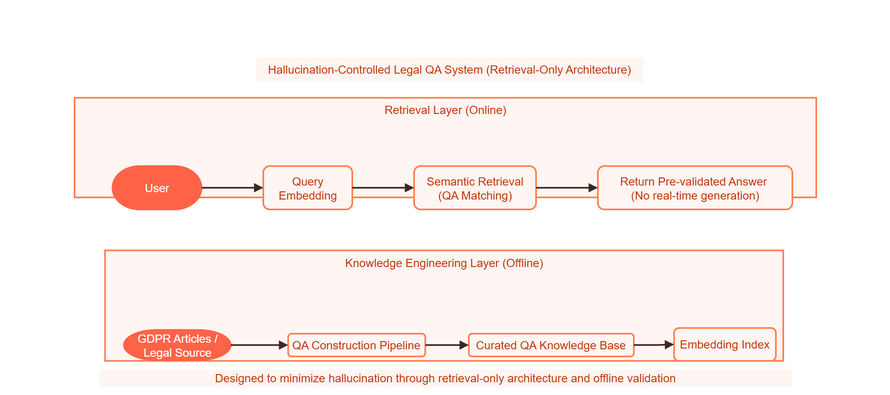
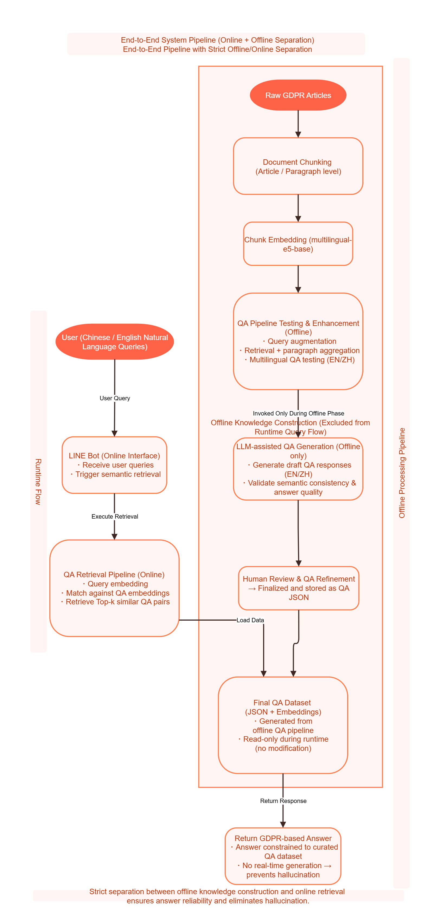

# System Overview

## Architecture Summary

This project adopts a **two-phase architecture** designed to ensure **high reliability, controllability, and traceability** in legal question answering.

Instead of relying on real-time large language model (LLM) generation, the system separates:

* **Offline Construction Phase (Knowledge Engineering)**
* **Online Query Service Phase (Retrieval Only)**

This design significantly reduces the risk of **legal hallucination** and ensures that all responses are based on **validated legal content**.

---

## Architecture Diagram

### Final Architecture (Simplified)

### Full System Pipeline

---

## 1. Offline Construction Phase

The offline phase is responsible for building a **validated and structured legal knowledge base**.

### Key Steps

#### 1. Data Collection & Structuring

* GDPR Articles 1–11 are collected and standardized
* Legal text is normalized into machine-readable format

#### 2. Semantic Chunking

* Legal content is split into **semantically meaningful units**
* Chunking is based on **article / paragraph structure**, not fixed length
* Ensures preservation of legal meaning

#### 3. Embedding Construction

* Each chunk is converted into a semantic vector
* Model used: `multilingual-e5-base`
* Enables cross-lingual semantic retrieval (EN / ZH)

#### 4. Offline QA Validation Pipeline

* Multiple test queries (EN & ZH) are generated
* Retrieval results are evaluated and refined

ChatGPT API is used **only in this stage** for:

* answer validation
* semantic consistency checking
* bilingual alignment verification

> ⚠️ The LLM is NOT used in the final system output.

#### 5. QA Finalization

* Validated answers are manually reviewed and refined
* Stored in a structured **QA JSON database**

Each entry includes:

* question
* mapped GDPR article
* finalized answer
* embedding vector

---

## 2. Online Query Service Phase

The online system is designed to be **fully deterministic and controllable**.

### Workflow

1. User submits a question via LINE Bot
2. The query is converted into an embedding
3. Cosine similarity is computed against QA embeddings
4. Top-k most relevant QA entries are retrieved
5. The **pre-validated answer** is returned

---

## Key Design Constraint

> 🚫 No real-time LLM generation is used in production.

This ensures:

* consistent outputs
* zero hallucination risk
* full traceability to legal sources

---

## 3. Design Philosophy

This system is **not a generative chatbot**, but a:

> **Controlled Legal Q&A System**

### Core Principles

* LLM is used as a **validator, not a generator**
* Final answers are **fixed and reviewable**
* Retrieval replaces generation
* Every response is **traceable to GDPR articles**

---

## Why This Matters

In legal and compliance scenarios:

* incorrect answers can have **serious consequences**
* LLM hallucination is **unacceptable**
* consistency and auditability are critical

This architecture ensures:

* **high reliability**
* **legal safety**
* **engineering transparency**

---

## System Characteristics

| Feature           | Design Choice                  |
| ----------------- | ------------------------------ |
| Answer Generation | ❌ Disabled                     |
| Retrieval Method  | Semantic similarity            |
| Data Source       | Pre-validated QA JSON          |
| LLM Usage         | Offline validation only        |
| Language Support  | English / Chinese              |
| Traceability      | Full (mapped to GDPR articles) |

---

## Summary

This project demonstrates a practical approach to building:

> **AI-assisted systems with strict control over output quality**

By combining:

* semantic retrieval
* offline validation
* fixed knowledge base

the system achieves a balance between:

* AI capability
* legal reliability
* production safety

---
