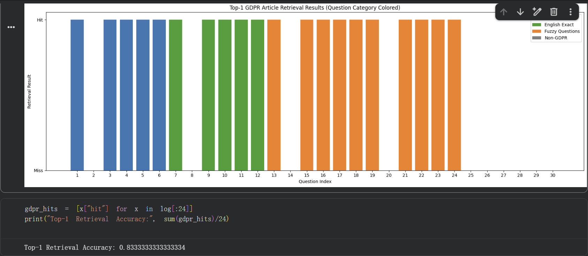

# Retrieval Evaluation

## Overview

This project is a **retrieval-based legal QA system**, not a real-time generative chatbot.

Instead of generating answers directly with an LLM during runtime, the system retrieves responses from a **pre-validated QA knowledge base** built from GDPR Articles 1–11. Because of this design, traditional supervised learning metrics such as classification accuracy or F1-score are not appropriate as the primary evaluation framework.

This evaluation therefore focuses on four system-level goals:

- retrieval correctness  
- legal alignment  
- response safety  
- knowledge boundary control  

The purpose is not only to measure whether the system can retrieve relevant legal content, but also whether it can behave **safely and predictably** under realistic legal-query conditions.

---

## Evaluation Setup

### Test Dataset

A total of **30 manually designed test questions** were used to evaluate system behavior across different query types.

The test set includes:

1. **Bilingual queries (English / Chinese)**  
   These evaluate whether the system can maintain retrieval quality across multilingual inputs.

2. **Semantic / ambiguous queries**  
   These use different phrasings with similar legal meaning in order to test semantic robustness.

3. **Non-GDPR / irrelevant queries**  
   These evaluate whether the fallback mechanism correctly prevents unsupported answers.

4. **Knowledge-boundary queries (critical cases)**  
   These are GDPR-related questions that intentionally fall **outside the system’s supported data scope** (Articles 1–11).  
   They are used to test whether the system can correctly recognize scope limitations **without fabricating legal answers**.

This evaluation setup is important because a legal QA system should not be judged only by how often it answers correctly, but also by whether it knows **when not to answer**.

---

## Evaluation Metrics

### 1. Top-1 Retrieval Accuracy (Similarity Hit Rate)

This metric evaluates whether the system retrieves the correct GDPR article at rank 1.

It is based on cosine similarity between:

- the query embedding
- the stored embeddings of legal chunks / QA entries

The predicted article in the Top-1 result is compared against the ground-truth article.

If they match, the case is counted as a **hit**.

This metric is conceptually similar to **precision@1** in information retrieval.

---

### 2. Correct Article Alignment

This metric evaluates whether the **final answer is grounded in the correct legal article**.

This is especially important in legal AI systems, because an answer may appear semantically plausible while still being legally incorrect if it relies on the wrong article.

This metric therefore focuses on:

- whether the retrieved answer aligns with the intended GDPR provision
- whether the answer remains legally traceable
- whether the legal basis of the response is correct

---

### 3. Fallback Trigger Reasonableness

This metric evaluates whether the system correctly avoids answering when:

- the query is unrelated to GDPR
- the question is irrelevant to the supported legal domain
- insufficient supporting legal data exists within the system

In such cases, the system should trigger a **fallback response** instead of producing a fabricated answer.

This metric is important because response refusal is often safer than an incorrect legal answer.

---

### 4. Knowledge Boundary Control (Critical)

This metric evaluates whether the system correctly handles questions that are:

- still related to GDPR
- but outside the system’s explicit knowledge scope (Articles 1–11)

These are not irrelevant questions, and therefore they should **not** be treated the same way as generic fallback cases.

Instead, the system is expected to:

- recognize that the question is legally relevant
- recognize that the answer cannot be supported by the current dataset
- explicitly communicate the scope limitation
- avoid extending beyond validated knowledge

This is a critical safety metric because legal AI systems must avoid **overclaiming competence beyond their supported corpus**.

---

### 5. LLM-based Answer Quality Evaluation (Gemini)

To provide an additional qualitative check, all 30 QA outputs were reviewed using Gemini.

The model was instructed to assess:

- legal answer quality
- clarity of explanation
- structural consistency
- alignment between cited article and answer content

This is used only as a **secondary qualitative evaluation tool** rather than the primary measurement framework.

---

## Results

### Top-1 Retrieval Accuracy

For GDPR-related in-scope questions, the system achieved:

- **Top-1 retrieval accuracy: 83.3%**

This indicates that the system can correctly identify the intended legal basis in most test cases.

The remaining misses were mainly associated with:

- semantically ambiguous phrasings
- overlapping legal concepts
- boundary cases where the wording was broader than the covered article set

---

## Retrieval Visualization

The following chart summarizes Top-1 retrieval hit/miss behavior:

---

## Key Observations

### 1. Strong multilingual retrieval behavior

The system performed well on both English and Chinese queries.

This suggests that:

- the bilingual preprocessing strategy
- the embedding pipeline
- and the controlled QA design

were sufficient to support multilingual legal question retrieval within the covered scope.

---

### 2. Improved semantic robustness after chunking and QA refinement

After introducing:

- structure-aware chunking
- offline QA validation
- refined answer finalization

the system showed noticeably more stable retrieval behavior.

Compared with earlier iterations, the final system demonstrated:

- less cross-article confusion
- fewer semantically fragmented matches
- better response consistency for paraphrased questions

---

### 3. Effective fallback handling for irrelevant queries

For clearly non-GDPR or irrelevant questions, the system did not attempt to generate legal answers.

Instead, it triggered a fallback response, which helped prevent:

- unsupported legal claims
- misleading outputs
- hallucinated compliance guidance

This confirms that the system can reject irrelevant questions in a controlled way.

---

### 4. Successful knowledge boundary control for out-of-scope legal questions

One of the most important findings is that the system was able to correctly handle **GDPR-related but out-of-scope questions**.

In these cases, the query was legally relevant, but the answer required articles outside the supported range (Articles 1–11). Instead of fabricating an answer or extending beyond the available corpus, the system explicitly acknowledged the limitation of its current knowledge scope.

This behavior is important because it shows that the system can distinguish between:

- **irrelevant questions** → fallback behavior  
- **relevant but unsupported legal questions** → scope-aware boundary control  

This is a critical distinction in legal AI design.

---

### 5. Stable and predictable answer behavior

Across the test set, the system exhibited stable output behavior:

- answers were deterministic
- no runtime answer drift occurred
- responses remained traceable to validated QA entries

This is one of the main advantages of using a controlled retrieval architecture instead of real-time LLM generation.

---

## Gemini Evaluation Summary

Gemini-based review indicated that the generated responses were generally:

- legally well-structured
- consistent in article-based explanation
- readable in both Chinese and English
- aligned with the intended legal basis

More importantly, Gemini-supported review also reinforced the observation that the system behaved conservatively in cases where:

- the question was outside scope
- the legal basis was not sufficiently supported by the current dataset

This supports the broader design goal of building a system that is:

> **reliable, controllable, and auditable**

---

## Limitations of the Evaluation

This evaluation should still be interpreted with appropriate caution.

### 1. Small-scale test set
The current evaluation uses only 30 manually designed questions.

### 2. Domain-bounded scope
The covered knowledge base is limited to GDPR Articles 1–11.

### 3. Retrieval-centric evaluation
The evaluation focuses on retrieval and answer control, not on broad legal reasoning capabilities.

### 4. Partial qualitative dependence
Gemini evaluation is used as a secondary quality signal, not as a formal legal benchmark.

Even so, these limitations do not undermine the main finding of the project: the system performs meaningfully well within its intended scope and behaves safely outside it.

---

## Conclusion

The evaluation results support four main conclusions:

1. The system achieves strong retrieval accuracy for in-scope legal questions.  
2. The system maintains legal traceability by grounding answers in the correct GDPR articles.  
3. The system appropriately triggers fallback behavior for irrelevant questions.  
4. The system enforces **knowledge boundaries** instead of pretending to answer beyond its validated corpus.  

This last point is especially important.

A legal AI system should not only answer correctly — it should also know when **not** to answer.

This project shows that a **controlled retrieval-based architecture** can provide a safer alternative to fully generative legal QA systems by prioritizing:

- correctness over flexibility  
- traceability over fluency  
- boundary awareness over overconfident generation  
